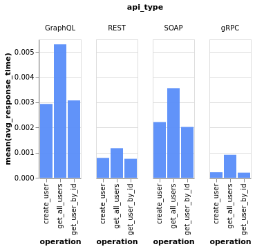
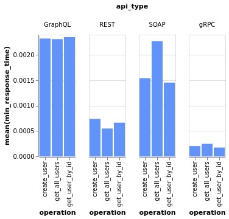
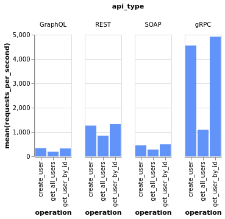

# Week 1 API Demo + Benchmarking

## Thông tin nhóm

Lớp Kiến trúc hướng dịch vụ - `INT3505E 2` - `2526 I` - UET-VNU.

Thành viên nhóm:

1. Nguyễn Mạnh Hùng (trưởng nhóm)
2. Lê Thành Đạt
3. Lê Bá Hoàng
4. Vũ Tùng Lâm
5. Khổng Mạnh Tuấn

## Demo

Demo của từng loại API được cho trong
thư mục có tên tương ứng (`SOAP`, `gRPC`...).

Trong mỗi thư mục đó có file `README.md`
riêng chứa thông tin demo (lý thuyết,
cách setup, cách chạy...).

## Benchmarking

Xem file `README.md` trong thư mục `benchmarking`.

Kết quả benchmark:

1. **Thời gian phản hồi trung bình** (thấp hơn là tốt hơn):

    

2. **Thời gian phản hồi nhanh nhất** (thấp hơn là tốt hơn):

    

3. **Số requests trung bình trên giây** (cao hơn là tốt hơn):
    
    
