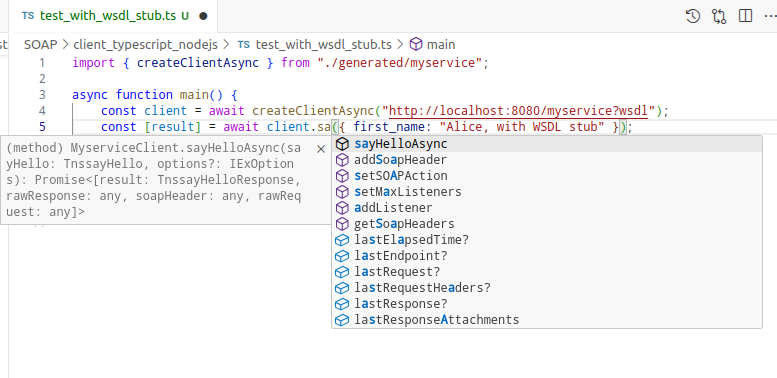
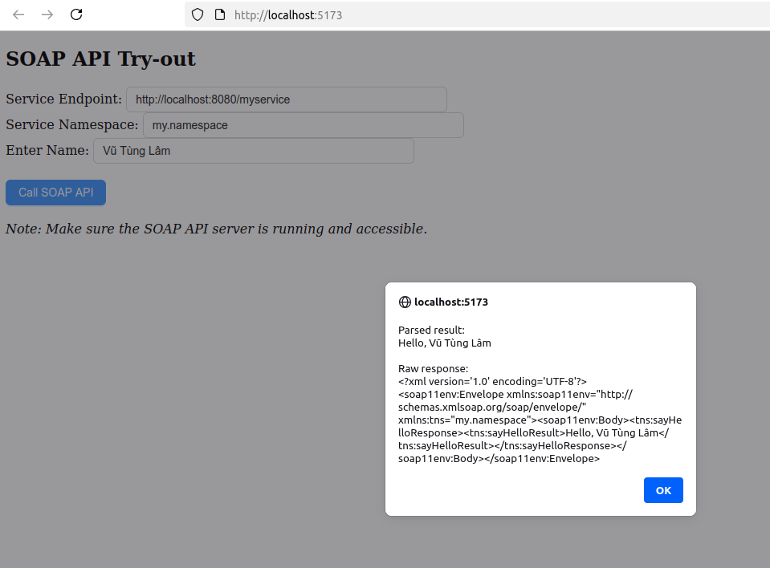

# Demo SOAP API

- [Demo SOAP API](#demo-soap-api)
  - [Lý thuyết](#lý-thuyết)
    - [Giới thiệu về SOAP](#giới-thiệu-về-soap)
    - [Định dạng Thông điệp trong SOAP](#định-dạng-thông-điệp-trong-soap)
    - [Giới thiệu về WSDL](#giới-thiệu-về-wsdl)
  - [Demo](#demo)
    - [Giới thiệu demo](#giới-thiệu-demo)
    - [Các công cụ cần cài đặt](#các-công-cụ-cần-cài-đặt)
    - [Setup và chạy Server (Python)](#setup-và-chạy-server-python)
    - [Setup và chạy Client (TypeScript/Node.js) không dùng WSDL stub code](#setup-và-chạy-client-typescriptnodejs-không-dùng-wsdl-stub-code)
    - [Setup và chạy Client (TypeScript/Node.js) dùng WSDL stub code](#setup-và-chạy-client-typescriptnodejs-dùng-wsdl-stub-code)
    - [Setup và chạy Client (TypeScript/React)](#setup-và-chạy-client-typescriptreact)

## Lý thuyết

### Giới thiệu về SOAP

SOAP (Simple Object Access Protocol) là một giao thức dựa trên XML để trao đổi thông điệp giữa các ứng dụng qua mạng.

Nó thường chạy trên HTTP hoặc SMTP, được thiết kế để **định dạng dữ liệu theo chuẩn XML**, giúp các hệ thống khác nhau (viết bằng nhiều ngôn ngữ lập trình hoặc chạy trên nhiều nền tảng) có thể giao tiếp với nhau một cách thống nhất.

Đặc điểm chính của SOAP:

- Sử dụng **XML** làm định dạng thông điệp.
- Hỗ trợ nhiều giao thức truyền tải (HTTP, SMTP...).
- Thường đi kèm với **WSDL** (Web Services Description Language) để mô tả chi tiết API (các phương thức, kiểu dữ liệu, endpoint...).
  - SOAP không bắt buộc phải có WSDL.
  - WSDL chỉ là một "hợp đồng" (contract) có nhiệm vụ:
    - Mô tả API (endpoint, phương thức, tham số, kiểu dữ liệu).
    - Giúp tự động sinh code client/server trong nhiều ngôn ngữ.
  - Chức năng tương tự OpenAPI/Swagger.
  - Nếu không có WSDL:
    - Client và server vẫn có thể trao đổi thông điệp SOAP bằng XML theo chuẩn, miễn là hai bên thống nhất format.
    - Tuy nhiên, việc tích hợp sẽ khó hơn, vì lập trình viên phải tự viết request/response XML, thay vì để công cụ sinh ra từ WSDL.
- Đi kèm hệ sinh thái `WS-* standards` (WS-Security, WS-Transaction, WS-ReliableMessaging...) cho các yêu cầu nâng cao. Một số ví dụ:
  - `WS-Security`: Bảo mật ở mức thông điệp, end-to-end, không phụ thuộc vào kênh (khác với SSL/TLS bảo mật ở mức kênh truyền). `WS-Security` cho phép ký số (digital signature), mã hóa (encryption), chèn thông tin xác thực (username/password, token, certificate) ngay trong thông điệp SOAP XML.
  - `WS-ReliableMessaging` đảm bảo thông điệp SOAP được gửi đúng, đủ, và theo thứ tự. Trong môi trường mạng không ổn định, thông điệp có thể bị mất hoặc gửi trùng. (Với các loại API khác như REST và gRPC, cần viết custom logic như tự động retry... để đảm bảo tính ổn định này.)
  - `WS-AtomicTransaction` và `WS-Coordination` cho phép nhiều dịch vụ SOAP tham gia một giao dịch phân tán (distributed transaction).
    - Trong ngân hàng hay thương mại điện tử, cần đảm bảo tính atomic trên toàn hệ thống.
    - Tức là, giao dịch thành công trên tất cả các dịch vụ liên quan, hoặc tất cả các dịch vụ đó phải rollback.
    - Nhiều dịch vụ cùng tham gia và đảm bảo atomic cho giao dịch đó, chứ không phải chỉ atomic trong phạm vi một database.
    - Với các loại API khác như REST... cần dùng Saga, Two-phase Commit... để giải quyết vấn đề giao dịch phân tán atomic.

### Định dạng Thông điệp trong SOAP

Thông thường để sử dụng một SOAP API,
client cần tạo một HTTP POST request đến
endpoint phù hợp, trong đó request body
là thông điệp bằng ngôn ngữ XML, có dạng
như sau:

```xml
<soapenv:Envelope xmlns:soapenv="http://schemas.xmlsoap.org/soap/envelope/"
                  xmlns:my="http://example.com/myservice">
   <soapenv:Header/>
   <soapenv:Body>
      <my:sayHello>
         <firstName>Alice</firstName>
      </my:sayHello>
   </soapenv:Body>
</soapenv:Envelope>
```

(thường các phương thức khác như GET, PUT,
PATCH... sẽ không được sử dụng.)

`xmlns` khai báo một XML namespace.
Đoạn `xmlns:my` khai báo một XML namespace gắn với prefix `my`.
Điều đó có nghĩa là, bất cứ phần tử
XML nào

- nằm trong `<soapenv:Body>`
- có tên bắt đầu bằng `my:` (ví dụ `<my:sayHello>` phía trên)

thì những phần tử đó thuộc namespace `http://example.com/my-service`,
đại diện cho một operation (hành động) mà client yêu cầu service thực hiện.

[Ví dụ về React client phía dưới](#setup-và-chạy-client-typescriptreact)
sẽ tạo thủ công một thông điệp XML như vậy,
và gửi cho server SOAP.

### Giới thiệu về WSDL

**WSDL** (viết tắt của Web Services Description Language) là là một tài liệu XML mô tả cấu trúc và cách sử dụng một dịch vụ SOAP.
- Tài liệu này cung cấp cho ứng dụng client những thông tin cần thiết về các chức năng của dịch vụ, bao gồm các phương thức có sẵn, các tham số đầu vào/ra và cách thức kết nối để sử dụng dịch vụ đó.
- Nó giống như một hợp đồng (contract) giữa SOAP server và SOAP client:
  - Server công bố WSDL.
  - Client đọc WSDL để biết:
    - Các endpoint URL của dịch vụ.
    - Các phương thức (operations) có sẵn.
    - Kiểu dữ liệu request/response (schema).

- Khi nào dùng WSDL?
  - Khi cần tích hợp dịch vụ SOAP giữa nhiều hệ thống/đội nhóm khác nhau, và cần một tài liệu mô tả chính xác dịch vụ.
  - Client có thể tự động sinh code stub từ WSDL → không cần tự viết XML request/response thủ công.
  - Trường hợp phổ biến:
    - Ngân hàng cung cấp API SOAP để tra cứu tài khoản → họ công bố file `.wsdl`.
    - Đơn vị khác (shop online, ứng dụng thanh toán...) import `.wsdl` vào IDE (Eclipse, IntelliJ, Visual Studio, SoapUI...), tool sẽ sinh ra sẵn các hàm gọi API như `getBalance()`, `transferMoney()`.
    - Lập trình viên chỉ việc gọi hàm, không cần quan tâm định dạng SOAP XML.

- Tổng kết:
  - Không có WSDL, client/server phải thống nhất request/response XML bằng tài liệu riêng.
  - Có WSDL, công cụ sẽ sinh code tự động, từ đó giảm lỗi và dễ bảo trì.

## Demo

### Giới thiệu demo

Demo minh họa cách xây dựng và gọi một dịch vụ SOAP:

- **SOAP Server**: Cung cấp một số hàm/dịch vụ cơ bản.
- **SOAP Client**: Gửi request và nhận response từ server.

### Các công cụ cần cài đặt

- Python 3.10
- Node.js 22+

### Setup và chạy Server (Python)

**Chú ý: Cần setup và chạy Server trước khi**
**setup Client, vì Client phụ thuộc vào WSDL mà**
**Server cung cấp (khi Server đang chạy).**

Setup:

```sh
cd <project_root>/SOAP
cd server_python
python3.10 -m venv venv
source ./venv/bin/activate
pip install -r requirements.txt
```

Chạy Server:

```sh
cd <project_root>/SOAP
cd server_python
source ./venv/bin/activate

python main.py
```

### Setup và chạy Client (TypeScript/Node.js) không dùng WSDL stub code

Setup:

```sh
cd <project_root>/SOAP
cd client_typescript_nodejs

npm i
```

Chạy Client:

```sh
npx tsx test_no_wsdl_stub.ts
```

Dù Client có nhận WSDL từ Server, nhưng do không có
stub code, người lập trình không biết mình đã gọi
đúng tên API hay không, từ đó có thể gây lỗi runtime.

### Setup và chạy Client (TypeScript/Node.js) dùng WSDL stub code

Để khắc phục hạn chế trên, có thể dùng tool tạo
stub code từ WSDL. Các bước thực hiện:

Setup môi trường:

```sh
cd <project_root>/SOAP
cd client_typescript_nodejs

npm i
```

Tạo WSDL stub code:

1. Lấy file WSDL từ Server:
    ```sh
    curl http://localhost:8080/myservice?wsdl > myservice.wsdl
    ```
    
2. Tạo stub code từ WSDL:

    ```sh
    npx wsdl-tsclient ./myservice.wsdl -o ./generated
    ```

Chạy Client có sử dụng (import) WSDL stub code vừa tạo:

```sh
npx tsx test_with_wsdl_stub.ts
```

Khi người lập trình viết lệnh gọi API, IDE sẽ tự động
suggest tên hàm, đã được định nghĩa theo đúng kiểu dữ liệu
trong TypeScript. Nhờ đó việc lập trình trở nên an toàn hơn.



### Setup và chạy Client (TypeScript/React)

Các Client trên sử dụng thư viện `soap`

```sh
npm install soap
```

để nhận WSDL và gọi SOAP API.

Tuy vậy thư viện này chỉ hỗ trợ
JS/TS runtime là Node.js, không hỗ trợ
runtime là browser (frontend).

Một cách giải quyết là dùng `wsdl2swagger2openapi`.
Tool này sẽ chuyển SOAP WSDL file thành file Swagger/OpenAPI JSON,
sau đó dùng tool tạo stub code từ file OpenAPI JSON
này, chẳng hạn `openapi-generator`. (Có thể thấy
cách chuyển đổi này không trực tiếp/straightforward).

Vì thế, trong ví dụ Frontend Client này,
chúng tôi **viết code thủ công để tạo XML payload**
**gửi đến SOAP API endpoint.**

Setup:

```sh
cd <project_root>/SOAP
cd client_typescript_react
yarn
```

Chạy Client:

```sh
yarn dev
```

Lệnh trên sẽ in ra địa chỉ frontend (chẳng hạn <http://localhost:5173>),
truy cập địa chỉ này để mở trang frontend sử dụng SOAP API.


